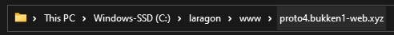
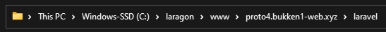
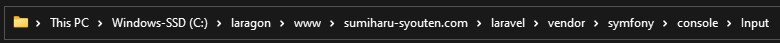

# bukkenoh_setup

## BUKKENOH PROTO4

This is after you're qualified or selected as a member of the Bukkenoh Team.

Requirements:
1. PHP 8.1.Xv || v8.2.6
2. Node 8.16.0 || v8.15.0
3. Composer 2.X.X || v2.5.8

### When Starting Coding 
1. Open the "Git Bash" and input __`cd c:laragon/www`__
2. Inside the "www" input __`git clone https://bukkenoh.backlog.com/git/SITE/proto4.bukken1-web.xyz.git`__
3. Go to the root folder of the project<br> 
4. Copy and paste the ".htaccess" file<br>
5. Go to the "laravel" folder of the project<br> 
6. Copy and paste the ".env" file<br>
7. Open the "Visual Studio Code" and make sure you're in your branch
8. Edit the ".env" file and save all the file edited
```diff

// default
- USER_ID = 43
- STORE_ID = 124

+ ROOT_URL = http://local.proto4.bukken1-web.xyz/

// can be found in the project wiki
+ USER_ID = 43
+ STORE_ID = 88

```
9. Go to your terminal and make sure you're in the root and in your branch<br>
10. Input __`cd laravel`__ and install composer __`composer install`__<br>
11. Create a new terminal and in you root input this __`cd src`__ and install yarn __`install yarn`__<br>
12. Inside the src folder input __`yarn watch`__
13. You're almost there! Make sure you start the laragon and go to your local, example "http://proto4.bukken1-web.xyz.test/"<br>
14. "Empty Cache and Hard Reload" your local after you load this "http://proto4.bukken1-web.xyz.test/cmd/makecache"<br>
15. The '0' will display

## NOTES!!!
This is for the older prototype.<br>

Requirements:
1. PHP 7.2.Xv || v7.2.19
2. Node 8.16.0 || v8.15.0
3. Composer 1.9.X || v1.9.3

### Oldest prototype
if it's still not working after "/cmd/makecache"<br>
go to "ArrayInput.php" this can be found here<br>

```diff

// default
- } elseif ('-' === $key[0]) {

// add this
+ } elseif (0 === strpos($key, '-')) {

```

### Others...
__`yarn watch --project sp`__ oldest prototype when there's sp folder<br>
__`yarn build`__ or __`yarn rebuild`__<br>
__`yarn iconfont`__

